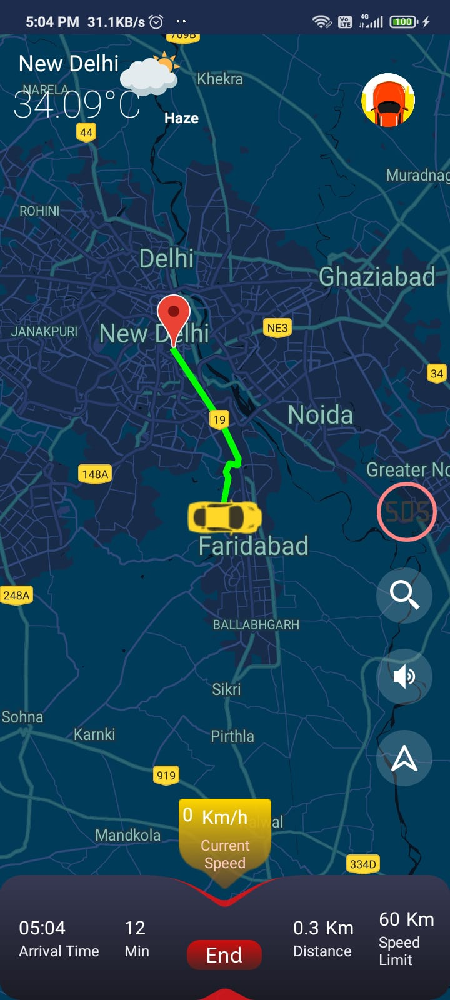
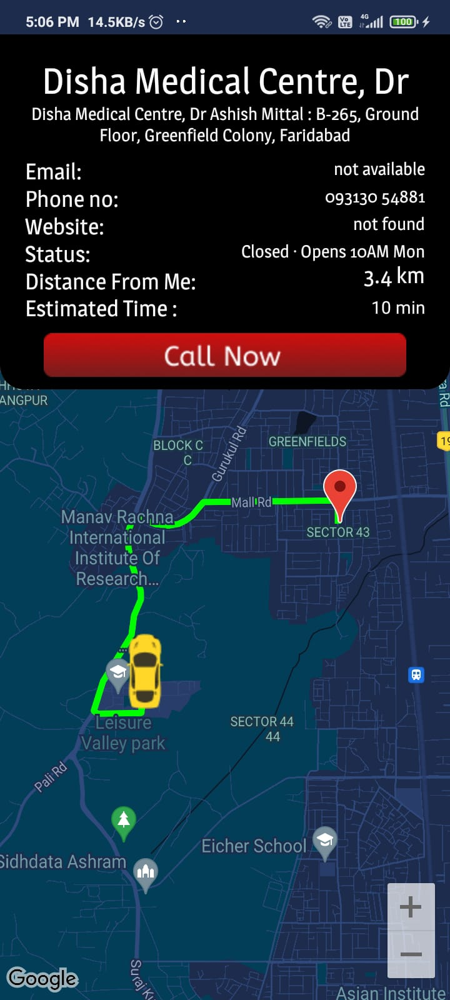
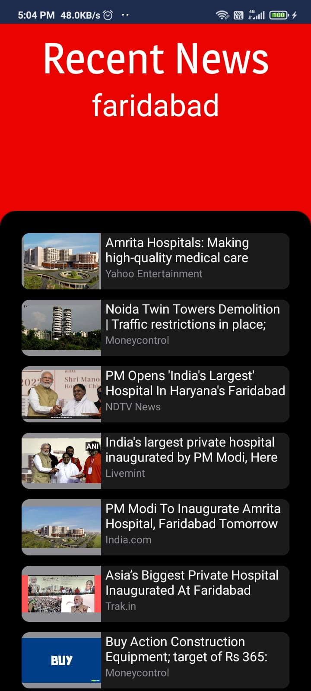
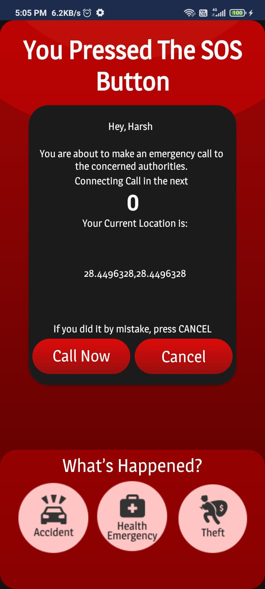
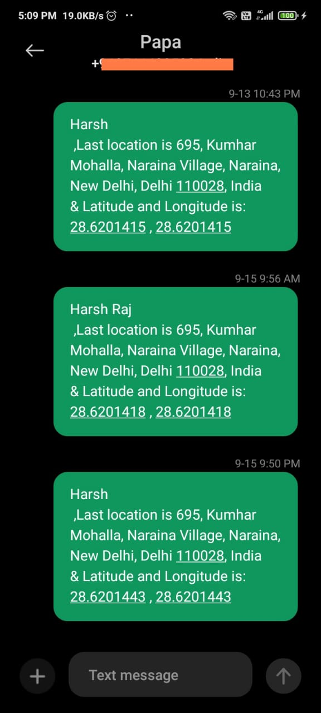

# DriveU
Hack The Mountains 3.0 Solution Application

## Vision
We aim at providing a single-stop solution for all driving-related issues to make journeys safe and smooth. 
The safety of the driver and the passenger is very important to us, so we are making this app keeping in mind about them.

## Solution Being Offered
- Real -time Emergency support. The SOS option helps to tackle emergencies.
- Dynamic weather forecast allowing one to prepare the necessities as the weather changes.
- On the way Fuel stations, Garages & Vehicle utitity stops (Petrol, CNG, EV-charging stations), with direct contact of garages and mechanics.
- Overspeeding alerts.

## Tech Used
   

## User Interface

 &nbsp;&nbsp;&nbsp;&nbsp;&nbsp;&nbsp;&nbsp;&nbsp;&nbsp;&nbsp;&nbsp;&nbsp;  &nbsp;&nbsp;&nbsp;&nbsp;&nbsp;&nbsp;&nbsp;&nbsp;&nbsp;&nbsp;&nbsp;&nbsp; 

 

  &nbsp;&nbsp;&nbsp;&nbsp;&nbsp;&nbsp;&nbsp;&nbsp;&nbsp;&nbsp;&nbsp;&nbsp; 

